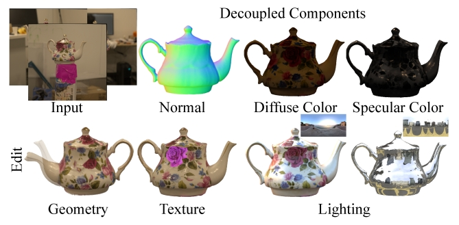

# DeferredGS: Decoupled and Relightable Gaussian Splatting with Deferred Shading
This repository contains the implementation with jittor for paper "DeferredGS: Decoupled and Relightable Gaussian Splatting with Deferred Shading".



## Set-up
### Basic Requirements
```
CUDA>=11
g++
```

### Conda
```
conda create -n jittordefergs python=3.10
conda activate jittordefergs
python3.10 -m pip install jittor
pip install -r requirements.txt
```
### Compile the submodules

The simple-knn ,diff_gaussian_rasterizater nvidiffrast-texture and renderutils modules should be compiled with cmake and make:

```
cd gaussian_renderer/diff_surfel_rasterization
cmake .
make -j
cd ../../scene/simple_knn
cmake .
make -j
cd ../NVDIFFREC/renderutils
cmake .
make -j
cd ../texture
cmake .
make -j
```

### LPIPS

The repository uses [Jittor_Perceptual-Similarity-Metric](https://github.com/ty625911724/Jittor_Perceptual-Similarity-Metric) for evaluation. Please download the pretrained model following the origin repository and put the weight file in lpips_jittor folder. 

## Get Starting

### 1.Dataset Preparation 

- [RefNerf Dataset](https://dorverbin.github.io/refnerf/) is supported,and other dataset needs to be modified in "scene/dataset_readers.py"(readCamerasFromTransforms to change the image/normal/alpha name):

  - The dafault version is 2DGS, we use it to guide normal optimization.
  
  - (Optional)you can modified the "surf_normal"(Line 105 in "train.py") to the normal image from other surface reconstruction methods.

### 2.Training
The same as 3DGS
```python
CUDA_VISIBLE_DEVICES=1 python train.py -s /data/refnerf/car -m output/car
```
If it appears "segment dafault", try to run "export debug=1"

### 3.Rendering & Evaluation

```python
# multi-view rendering 
python render.py -s /data/refnerf/car -m output/car
# multi-view relighting 
python render.py -s /data/refnerf/car -m output/car --novel_brdf_envmap envmap/sunset.exr
# evaluation
python metrics.py -m output/car
```


  

## Acknowledgements

The original implementation comes from the following cool project:

* [3DGS](https://github.com/graphdeco-inria/gaussian-splatting/)
* [gaussian-splatting-jittor](https://github.com/otakuxiang/gaussian-splatting-jittor.git)
* [Jittor-LPIPS](https://github.com/ty625911724/Jittor_Perceptual-Similarity-Metric)
* [nvidiffrast](https://github.com/NVlabs/nvdiffrast)